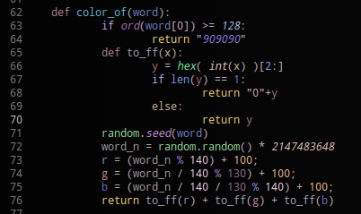
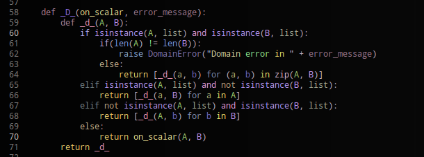
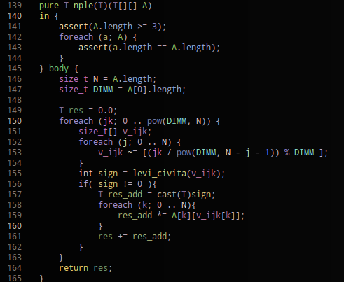

chalks
======

Script showing code in a browser colored for the ease of making code review. It doesn't do syntax highlighting, instead it highlight each word differently. This helps in seing patterns and spotting bugs in them.

